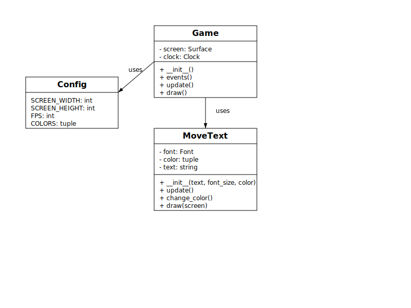

# DVD Animation Game

Este projeto implementa uma animação inspirada no icônico logo DVD que quica pela tela, com algumas variações adicionais.

## Requisitos

- Python 3.x
- Pygame

## Como configurar

1. Certifique-se de ter Python e Pygame instalados:

```
pip install pygame
```

2. Coloque arquivos de áudio nas pastas corretas:

   - Músicas de fundo em `/audios/musicas/` (fora da pasta DVD, formatos .mp3, .wav, .ogg)
   - Efeitos sonoros em `/audios/efeitos/` (fora da pasta DVD, formatos .mp3, .wav, .ogg)
   - **Importante**: Você precisa de pelo menos um arquivo de efeito sonoro chamado `colisao.mp3` (ou .wav/.ogg)
     para o som de colisão com as bordas.

3. Para personalizar o fundo:
   - Coloque uma imagem do espaço estrelado com o nome `espaco.jpg` (ou .png) na pasta `/imagens/`
   - Se a imagem não for encontrada, o programa usará um fundo cinza escuro

## Como executar

Execute o script principal:

```
python DVD/main.py
```

## Controles

- **Tecla S**: Troca para a próxima música
- **Tecla Espaço**: Pausa/resume a música atual
- **Fechar a janela**: Encerra o jogo

## Estrutura do projeto

- `base_texto.py`: Classe base abstrata para textos móveis
- `textos_moveis.py`: Implementações específicas de textos móveis (quicante, vertical, horizontal)
- `config.py`: Configurações gerais do jogo
- `cores.py`: Definições de cores utilizadas no jogo
- `movimento.py`: Funções para gerenciar movimento e velocidades
- `audio.py`: Gerenciamento de áudio (músicas e efeitos sonoros)
- `fundo.py`: Gerenciamento do fundo da aplicação
- `game.py`: Lógica principal do jogo
- `main.py`: Ponto de entrada do jogo

## Diagramas UML

### Diagrama pré-refatoração

Para incluir o diagrama UML antes da refatoração:



### Diagrama pós-refatoração

Para incluir o diagrama UML após a refatoração, salve a imagem como `uml_pos_refatoracao.svg` na pasta `docs/`:

_Nota: O arquivo do diagrama pós-refatoração ainda não foi adicionado à pasta docs._

## Observação

As pastas `audios/` e `imagens/` devem estar localizadas no mesmo nível da pasta `DVD/`, e não dentro dela. O sistema buscará os arquivos um nível acima da pasta do projeto.
